# Backend UML Class Diagram

```mermaid
classDiagram
    %% Main Application
    class App {
        +express: Express
        +initialize()
        +errorHandler()
    }

    %% Routes
    class Routes {
        +registerRoutes()
        +router: Router
    }

    class AuthRoutes {
        +POST /register
        +POST /login
        +POST /refresh
        +POST /logout
    }

    class ProfileRoutes {
        +GET /profile/:id
        +PUT /profile/:id
        +GET /documents/:userId/:docType
    }

    class JobRoutes {
        +GET /jobs
        +POST /jobs
        +PUT /jobs/:id
        +DELETE /jobs/:id
    }

    class AdminRoutes {
        +GET /users
        +PUT /users/:id/status
        +POST /professors
    }

    class NotificationRoutes {
        +GET /notifications
        +PUT /notifications/:id/read
    }

    class AnnouncementRoutes {
        +GET /announcements
        +POST /announcements
    }

    class DegreeRoutes {
        +GET /degrees
        +POST /degrees
    }

    %% Controllers
    class AuthController {
        +register()
        +login()
        +refreshToken()
        +logout()
    }

    class ProfileController {
        +getProfile()
        +updateProfile()
        +uploadDocument()
        +getDocument()
    }

    class JobController {
        +getJobs()
        +createJob()
        +updateJob()
        +deleteJob()
        +applyForJob()
    }

    class AdminController {
        +getAllUsers()
        +updateUserStatus()
        +createProfessor()
        +getSystemStats()
    }

    class NotificationController {
        +getNotifications()
        +markAsRead()
        +markAllAsRead()
    }

    class AnnouncementController {
        +getAnnouncements()
        +createAnnouncement()
        +updateAnnouncement()
    }

    class DegreeController {
        +getAllDegrees()
        +createDegree()
    }

    class JobReportController {
        +reportJob()
        +getReports()
    }

    %% Services
    class AuthService {
        +registerUser()
        +loginUser()
        +refreshAccessToken()
        +logoutUser()
    }

    class ProfileService {
        +getProfileByUserId()
        +updateProfile()
        +uploadDocument()
    }

    class JobService {
        +getAllJobs()
        +getJobById()
        +createJob()
        +updateJob()
        +deleteJob()
        +applyForJob()
    }

    class AdminService {
        +getAllUsers()
        +updateUserStatus()
        +createProfessor()
        +getStatistics()
    }

    class UserService {
        +getUserById()
        +updateUser()
        +deleteUser()
    }

    class NotificationService {
        +createNotification()
        +getNotifications()
        +markAsRead()
        +sendEmailNotification()
    }

    class AnnouncementService {
        +getAnnouncements()
        +createAnnouncement()
        +updateAnnouncement()
        +deleteAnnouncement()
    }

    class DegreeService {
        +getAllDegrees()
        +createDegree()
        +getDegreeById()
    }

    class JobReportService {
        +createReport()
        +getReportsByJobId()
        +updateReportStatus()
    }

    class StorageFactory {
        +getStorageProvider()
    }

    class LocalStorageProvider {
        +uploadFile()
        +downloadFile()
        +deleteFile()
    }

    class S3StorageProvider {
        +uploadFile()
        +downloadFile()
        +deleteFile()
    }

    %% Middlewares
    class AuthMiddleware {
        +authenticate()
        +verifyToken()
    }

    class RoleMiddleware {
        +requireRole()
        +requireAdmin()
    }

    class ErrorHandler {
        +errorHandler()
        +asyncErrorHandler()
    }

    class RateLimitMiddleware {
        +createRateLimit()
    }

    class DownloadRateLimit {
        +downloadRateLimit()
    }

    class ValidateMiddleware {
        +validate()
    }

    %% Validators
    class AuthValidator {
        +registerSchema
        +loginSchema
    }

    class ProfileValidator {
        +updateProfileSchema
    }

    class JobValidator {
        +createJobSchema
        +updateJobSchema
    }

    class AdminValidator {
        +updateUserStatusSchema
        +createProfessorSchema
    }

    class NotificationValidator {
        +markAsReadSchema
    }

    class ReportValidator {
        +reportJobSchema
    }

    %% Utils
    class TokenUtils {
        +generateAccessToken()
        +generateRefreshToken()
        +verifyRefreshToken()
        +generateJwtId()
    }

    class PasswordUtils {
        +hashPassword()
        +comparePassword()
        +generateSecurePassword()
    }

    class EmailUtils {
        +sendEmail()
        +sendProfessorWelcomeEmail()
        +sendJobApplicationEmail()
    }

    class PassportUtil {
        +initialize()
        +authenticateJWT()
    }

    class DocumentAuthz {
        +canAccessDocument()
        +validateDocumentOwnership()
    }

    class AuditLogger {
        +logAction()
        +logAdminAction()
    }

    %% Models
    class PrismaClient {
        +user
        +profile
        +job
        +notification
        +announcement
        +degree
        +jobReport
    }

    %% Relationships - App to Routes
    App --> Routes : uses
    App --> ErrorHandler : uses
    App --> PassportUtil : initializes

    %% Relationships - Routes to Controllers
    Routes --> AuthRoutes : includes
    Routes --> ProfileRoutes : includes
    Routes --> JobRoutes : includes
    Routes --> AdminRoutes : includes
    Routes --> NotificationRoutes : includes
    Routes --> AnnouncementRoutes : includes
    Routes --> DegreeRoutes : includes

    AuthRoutes --> AuthController : routes to
    AuthRoutes --> AuthValidator : validates with
    AuthRoutes --> ValidateMiddleware : uses

    ProfileRoutes --> ProfileController : routes to
    ProfileRoutes --> AuthMiddleware : protected by
    ProfileRoutes --> ProfileValidator : validates with

    JobRoutes --> JobController : routes to
    JobRoutes --> AuthMiddleware : protected by
    JobRoutes --> JobValidator : validates with

    AdminRoutes --> AdminController : routes to
    AdminRoutes --> AuthMiddleware : protected by
    AdminRoutes --> RoleMiddleware : protected by
    AdminRoutes --> AdminValidator : validates with

    NotificationRoutes --> NotificationController : routes to
    NotificationRoutes --> AuthMiddleware : protected by

    AnnouncementRoutes --> AnnouncementController : routes to
    AnnouncementRoutes --> AuthMiddleware : protected by
    AnnouncementRoutes --> RoleMiddleware : protected by

    DegreeRoutes --> DegreeController : routes to

    %% Relationships - Controllers to Services
    AuthController --> AuthService : uses
    ProfileController --> ProfileService : uses
    ProfileController --> StorageFactory : uses
    JobController --> JobService : uses
    JobController --> NotificationService : uses
    AdminController --> AdminService : uses
    AdminController --> UserService : uses
    NotificationController --> NotificationService : uses
    AnnouncementController --> AnnouncementService : uses
    DegreeController --> DegreeService : uses
    JobReportController --> JobReportService : uses

    %% Relationships - Services to Models
    AuthService --> PrismaClient : queries
    ProfileService --> PrismaClient : queries
    JobService --> PrismaClient : queries
    AdminService --> PrismaClient : queries
    UserService --> PrismaClient : queries
    NotificationService --> PrismaClient : queries
    AnnouncementService --> PrismaClient : queries
    DegreeService --> PrismaClient : queries
    JobReportService --> PrismaClient : queries

    %% Relationships - Services to Utils
    AuthService --> PasswordUtils : uses
    AuthService --> TokenUtils : uses
    AdminService --> PasswordUtils : uses
    AdminService --> EmailUtils : uses
    NotificationService --> EmailUtils : uses
    ProfileController --> DocumentAuthz : uses
    AdminController --> AuditLogger : uses

    %% Storage relationships
    StorageFactory --> LocalStorageProvider : creates
    StorageFactory --> S3StorageProvider : creates

    %% Middleware relationships
    AuthMiddleware --> TokenUtils : uses
    AuthMiddleware --> PassportUtil : uses
    RoleMiddleware --> AuthMiddleware : depends on
```

## Architecture Overview

### Layers:
1. **Routes Layer** - HTTP endpoint definitions
2. **Controller Layer** - Request/response handling
3. **Service Layer** - Business logic
4. **Model Layer** - Data access (Prisma)

### Cross-cutting Concerns:
- **Middlewares** - Authentication, authorization, validation, error handling
- **Validators** - Request validation schemas
- **Utils** - Shared utility functions

### Key Patterns:
- **MVC Pattern** - Routes → Controllers → Services → Models
- **Factory Pattern** - StorageFactory for storage providers
- **Middleware Chain** - Request processing pipeline
- **Dependency Injection** - Services injected into controllers
